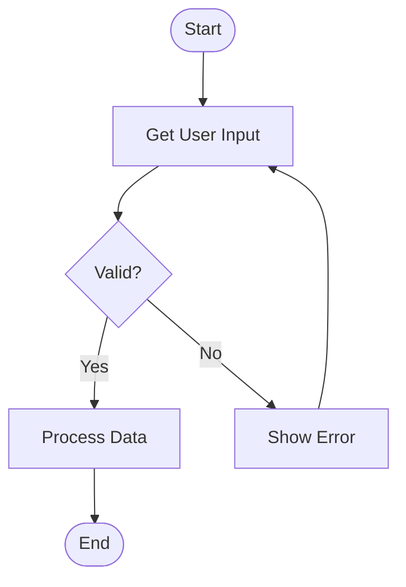

# Diagram Converter Agent - Cross-Platform Usage Guide

This guide explains how to use the **Diagram Converter Agent (Mira)** with various AI chat interfaces outside of VS Code.

## Overview

The Diagram Converter is a pure LLM agent defined in markdown/XML format. It converts Mermaid diagrams to:
- **Draw.io XML** (for all major diagram types)
- **Markdown documentation**

### Supported Diagram Types

| Type | Mermaid Keyword | Description |
|------|-----------------|-------------|
| Flowchart | `flowchart` / `graph` | Process flows, decision trees |
| ER Diagram | `erDiagram` | Entity-relationship diagrams |
| Sequence | `sequenceDiagram` | Interaction sequences |
| Class | `classDiagram` | UML class diagrams |
| Mindmap | `mindmap` | Hierarchical mind maps |
| Git Graph | `gitGraph` | Git commit histories |

Since it's just a text-based prompt, it works with **any AI that supports system prompts or custom instructions**.

---

## Quick Start (Any Platform)

### Step 1: Get the Agent File
Copy the entire contents of:
```
bmad/agents/diagram-converter/diagram-converter.md
```

### Step 2: Create a Config File (Optional but Recommended)
Create a simple config for personalization:
```yaml
# config.yaml
user_name: "YourName"
communication_language: "English"
output_folder: "./output"
```

### Step 3: Load into Your AI Interface
See platform-specific instructions below.

---

## Platform-Specific Instructions

### 🟣 Claude.ai (Web Interface)

1. **Start a new conversation**
2. **Paste the entire agent file** as your first message with this prefix:
   ```
   Please embody this agent persona and follow its instructions exactly:
   
   [PASTE ENTIRE diagram-converter.md CONTENT HERE]
   ```
3. **In your next message**, provide your config:
   ```
   My config:
   - user_name: Alex
   - communication_language: English
   
   Ready to start!
   ```
4. **Mira will greet you and show the menu**
5. **Provide a Mermaid diagram** to convert:
   ```
   Please convert this to Draw.io:
   
   ```mermaid
   flowchart TD
       A[Start] --> B{Decision}
       B -->|Yes| C[Process]
       B -->|No| D[End]
       C --> D
   ```
   ```

**Pro Tip:** Create a Claude Project and save the agent as project knowledge for reuse.

---

### 🟢 ChatGPT (Web Interface)

#### Option A: Custom GPT (Recommended)
1. Go to **Explore GPTs** → **Create**
2. In **Configure** tab:
   - Name: `Diagram Converter - Mira`
   - Description: `Converts Mermaid diagrams to Draw.io XML and Markdown`
   - Instructions: Paste the entire `diagram-converter.md` content
3. Save and use anytime

#### Option B: Direct Chat
1. Start with: `You are now Mira, the Diagram Conversion Specialist. Here are your complete instructions:`
2. Paste the agent file
3. Follow with your Mermaid diagram

---

### 🔵 Claude Desktop (with Projects)

1. **Create a new Project**
2. **Add Knowledge**: Upload `diagram-converter.md`
3. **Set Project Instructions**:
   ```
   Always embody the Mira agent defined in the uploaded diagram-converter.md file.
   Start by greeting the user and showing the menu.
   ```
4. Start chatting - Mira is ready!

---

### ⚫ Claude Code CLI

```bash
# Basic usage - load agent as system prompt
cat bmad/agents/diagram-converter/diagram-converter.md | claude --system-prompt -

# Or reference the file directly
claude --system-prompt "$(cat bmad/agents/diagram-converter/diagram-converter.md)"
```

Then interact normally in the CLI.

---

### � MCP Server (Claude Desktop / Cline / Continue.dev)

For the best experience, use the **MCP Server** which provides native tool integration!

#### Setup for Claude Desktop

1. **Install the MCP server:**
   ```bash
   cd src/mcp-servers/diagram-converter
   npm install
   ```

2. **Add to Claude Desktop config:**
   
   **macOS:** `~/Library/Application Support/Claude/claude_desktop_config.json`
   **Windows:** `%APPDATA%\Claude\claude_desktop_config.json`
   
   ```json
   {
     "mcpServers": {
       "diagram-converter": {
         "command": "node",
         "args": ["/absolute/path/to/src/mcp-servers/diagram-converter/index.js"]
       }
     }
   }
   ```

3. **Restart Claude Desktop**

4. **Use naturally:**
   ```
   Convert this to Draw.io:
   
   flowchart TD
       A[Start] --> B{Decision}
       B --> C[End]
   ```

#### MCP Tools Available

| Tool | Description |
|------|-------------|
| `convert_mermaid_to_drawio` | Convert Mermaid → Draw.io XML |
| `convert_mermaid_to_markdown` | Convert Mermaid → Markdown docs |
| `validate_mermaid` | Check syntax & compatibility |
| `get_conversion_rules` | Get conversion ruleset |

See the full [MCP Server README](../src/mcp-servers/diagram-converter/README.md) for more details.

---

### �🟡 Cursor / Cline / Windsurf / Other AI IDEs

These IDEs support custom agent/persona loading:

#### Cursor
1. Open **Settings** → **Rules for AI**
2. Paste the agent content or reference the file path
3. Or use `@file` to reference: `@diagram-converter.md act as this agent`

#### Cline
1. Use the custom instructions feature
2. Reference the agent file in your workspace

#### Windsurf
1. Use Cascade's custom persona feature
2. Load the agent markdown as context

---

### 🔴 API Usage (Python Example)

```python
import anthropic

# Load the agent
with open("bmad/agents/diagram-converter/diagram-converter.md", "r") as f:
    agent_prompt = f.read()

client = anthropic.Anthropic()

# Create a conversation with the agent
message = client.messages.create(
    model="claude-sonnet-4-20250514",
    max_tokens=8192,
    system=agent_prompt,
    messages=[
        {
            "role": "user", 
            "content": """My config:
- user_name: Developer
- communication_language: English

Convert this to Draw.io:

```mermaid
erDiagram
    USER ||--o{ ORDER : places
    ORDER ||--|{ LINE_ITEM : contains
    PRODUCT ||--o{ LINE_ITEM : includes
```"""
        }
    ]
)

print(message.content[0].text)
```

#### OpenAI API
```python
from openai import OpenAI

with open("bmad/agents/diagram-converter/diagram-converter.md", "r") as f:
    agent_prompt = f.read()

client = OpenAI()

response = client.chat.completions.create(
    model="gpt-4o",
    messages=[
        {"role": "system", "content": agent_prompt},
        {"role": "user", "content": "Show menu"}
    ]
)

print(response.choices[0].message.content)
```

---

## Available Commands

Once the agent is loaded, use these commands:

| Command | Description |
|---------|-------------|
| `*help` | Show numbered menu |
| `*to-markdown` | Convert Mermaid → Markdown documentation |
| `*to-drawio` | Convert Mermaid flowchart → Draw.io XML |
| `*er-to-drawio` | Convert ER diagram → Draw.io XML |
| `*seq-to-drawio` | Convert sequence diagram → Draw.io XML |
| `*class-to-drawio` | Convert class diagram → Draw.io XML |
| `*git-to-drawio` | Convert gitGraph → Draw.io XML |
| `*mindmap-to-drawio` | Convert mindmap → Draw.io XML |
| `*convert-all` | Full pipeline (Mermaid → Markdown → Draw.io) |
| `*validate` | Validate Mermaid syntax |
| `*fix` | Fix non-compliant Mermaid code |
| `*rules` | Show conversion ruleset |
| `*exit` | Exit the agent |

---

## Using the Output

### Draw.io XML Output

1. **Copy the XML** output (everything between the xml code fences)
2. Go to [draw.io](https://app.diagrams.net)
3. **File** → **Import From** → **Text...**
4. Paste the XML and click **Import**
5. Your diagram appears!

### Alternative: Save as .drawio file
```bash
# Save the XML output to a file
echo '<YOUR_XML_HERE>' > my-diagram.drawio

# Open with Draw.io desktop app or upload to draw.io web
```

---

## Validating Mermaid Input

Before converting, you can validate your Mermaid diagrams:

1. **Mermaid Live Editor**: [mermaid.live](https://mermaid.live) - paste and preview
2. **Use the agent's `*validate` command** - checks syntax and conversion compatibility
3. **GitHub/GitLab**: Both render Mermaid in markdown files natively

---

## Troubleshooting

### Agent doesn't respond correctly
- Ensure you pasted the **complete** agent file (all 2700+ lines)
- Some platforms truncate long prompts - try a platform with higher limits

### XML output has errors
- Use the `*validate` command first to check your Mermaid syntax
- Ensure your Mermaid follows the agent's ruleset (use `*rules` to see them)

### Draw.io import fails
- Check for any extra text outside the XML code fence
- Ensure the XML declaration `<?xml version="1.0"...` is at the start

### Complex diagrams look wrong
- For ER diagrams with 6+ entities, the agent uses special layout algorithms
- Try breaking into smaller diagrams if needed

---

## Example Workflow

```
You: *help

Mira: Hello! I'm Mira, your Diagram Conversion Specialist 🔄
Here's what I can do:

1. Show numbered menu
2. Convert Mermaid diagram to Markdown documentation
3. Convert Mermaid flowchart to Draw.io XML format
...

You: 3

Mira: Please provide your Mermaid flowchart code.

You: 


Mira: [Returns complete Draw.io XML]

You: [Copy XML, import to draw.io, enjoy your diagram!]
```

---

## Platform Comparison

| Platform | System Prompt Support | Best For |
|----------|----------------------|----------|
| Claude.ai | ✅ Via first message | Quick one-off conversions |
| Claude Projects | ✅ Native | Repeated use, team sharing |
| ChatGPT Custom GPT | ✅ Native | Sharing with others |
| Claude Code CLI | ✅ Native | Developer workflows |
| API (Anthropic/OpenAI) | ✅ Native | Automation, integration |
| Cursor/Cline | ✅ Via rules/context | IDE-based workflows |

---

## Need Help?

- Check the `*rules` command for the complete conversion ruleset
- Use `*validate` before converting to catch issues early
- For complex ER diagrams, the agent has special handling (Section 5 & 14 in rules)

Happy diagramming! 🔄
